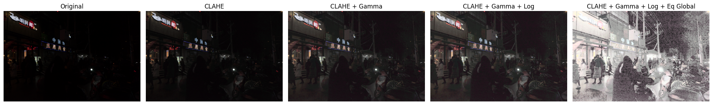

# Basic Image Enhancement - Night Images

## Overview
This project explores **basic image enhancement techniques** using OpenCV and Python, applied to images captured under low-light conditions.  

The work focuses on intensity transformations, histogram processing, and arithmetic operations, highlighting their strengths and limitations.

[Dataset used: **The Dark Face Dataset** (Rakshit, 2022)](https://www.kaggle.com/datasets/soumikrakshit/dark-face-dataset)  

---

## Original Images

The images represent night scenes with adverse lighting conditions, without prior processing.
These images will serve as a reference for comparing the enhancement techniques applied.

  
  
  
  

---

## Methods

The following enhancement techniques were applied to night images:

1. **Intensity Transformations**  
   - Logarithmic transformations (dynamic adjustment of parameter *c*)  
   - Gamma correction (adaptive adjustment of parameter *γ*)  

2. **Histogram Processing**  
   - Global histogram equalization  
   - Adaptive histogram equalization (CLAHE)  

3. **Arithmetic Operations**  
   - Addition, subtraction, multiplication, division applied with constant factors  

---

## Results

### Intensity Transformations
- **Logarithmic**: Enhanced dark areas while preserving bright regions. Best for shadow detail.  
- **Gamma**: Improved details but sometimes added a white overlay effect. Softer whites than log transform.  

### Histogram Processing
- **Global Equalization**: Increased contrast but caused color artifacts and noise.  
- **CLAHE**: Improved local contrast without color distortions. Less effective in very dark images.  

### Arithmetic Operations
- **Addition / Subtraction**: Simple, but poor contrast improvement.  
- **Multiplication / Division**: Brightened images and revealed details, but may create artificial white areas.  

---

### Comparative Summary

| Method              | Advantages                                | Limitations                          |
|---------------------|-------------------------------------------|--------------------------------------|
| **Logarithmic**     | Good for dark areas, preserves highlights | Dependent on parameter *c*           |
| **Gamma**           | Flexible brightness control               | Risk of whitening effect             |
| **Global Equalization** | Improves overall contrast             | Adds noise & artifacts                |
| **CLAHE**           | Better local contrast, no color shift     | Limited in very dark scenes          |
| **Arithmetic Ops**  | Simple and flexible                       | Poor control, may look artificial    |

---

### Example Results

  

  

  

  

 
---

## Conclusions

- **Most effective methods**:  
  - **Logarithmic Transformation**: Best for enhancing dark areas without oversaturating highlights.  
  - **CLAHE**: Effective for images with a wider range of illumination, improving local contrast without color artifacts.  

- **Other useful methods**:  
  - **Gamma correction**: Good for scenes with many bright areas, though less consistent in very dark images.  
  - **Multiplication/Division**: Useful for illumination adjustment but limited in very dark regions.  

---

### Successes
- Dynamic adjustment of parameters (*c* for logarithmic, γ for gamma) allowed adaptive image enhancement depending on lighting conditions.  
- Provided consistent improvements across different images.  

### Limitations
- Histogram Equalization and multiplication may cause oversaturation and color artifacts.  
- Gamma correction produced inconsistent results in extremely dark images.  
- Arithmetic operations alone were not sufficient to enhance very dark areas.  

### Future Work
- Explore more **adaptive and dynamic methods** to adjust parameters automatically.  
- Integrate **quantitative metrics** (e.g., contrast, image quality) for objective evaluation.  
- Combine multiple techniques for more robust enhancement in diverse scenarios.   

---

## Requirements
- Python 3.10+
- OpenCV
- NumPy
- Matplotlib

---

## Author
Selene González Curbelo  
Universidad Internacional de la Rioja (UNIR)  
Course: *Computer Vision*  
Date: 2024
