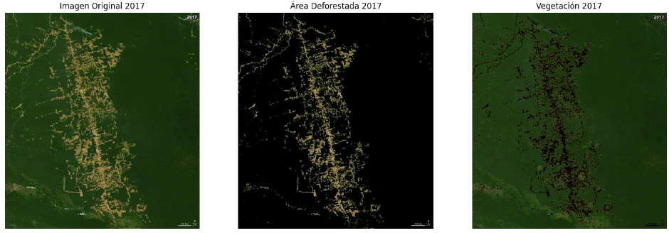
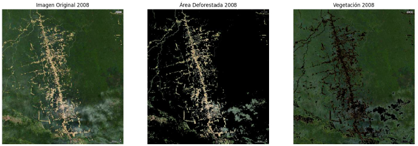
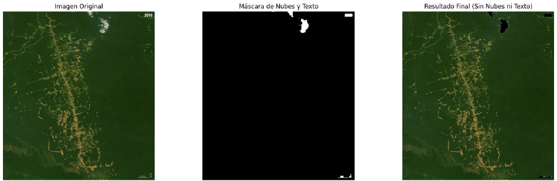
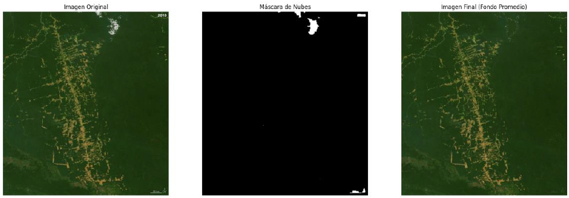
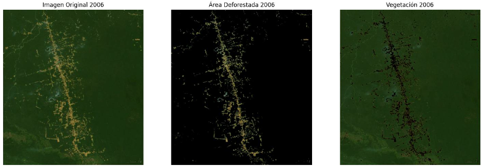

# Analysis of Deforestation in the Amazon Rainforest using Segmentation Techniques

## Overview

This project analyzes deforestation and vegetation areas in the Amazon rainforest using satellite images. Segmentation was performed in **RGB, HSV, and LAB color spaces** to identify areas of interest.  

Deforestation was detected via thresholds in color channels, and areas were calculated in km². Preprocessing techniques such as **morphological filters** and **inpainting** were applied to remove clouds and text, improving segmentation accuracy.

---

## Methods

### Satellite Images
- Images in **RGB format** (up to 20 images per year) were used.
- Frames represent yearly snapshots from 2000 to 2019.

### Preprocessing
- **Color Component Segmentation:** Separate R, G, B channels.
- **Color Spaces:** HSV and LAB for more robust segmentation.
- **Morphological Filters:** `MORPH_CLOSE` used to smooth cloud masks.
- **Mask Combination:** Bitwise operations to merge cloud and deforestation masks.
- **Inpainting & Average Background:** Remove clouds and text using inpainting or background filling.

### Segmentation Techniques
- **Thresholding RGB channels:** High red, moderate/low green, low blue for deforestation.
- **Otsu Thresholding:** Optimizes threshold for vegetation vs deforestation, improving consistency.
  
---

## Metrics
- **SSIM (Structural Similarity Index)** – Structural similarity, 0–1 (1 = max similarity).  
- **PSNR (Peak Signal-to-Noise Ratio)** – Signal-to-noise ratio in dB (higher = better).  
- **Morphological Area** – Evaluates black pixel areas for defect detection or segmentation accuracy.

---

## Results

### Initial Segmentation

  

Vegetation vs deforestation areas in 2017 without preprocessing.

### CLAHE Preprocessing

  

Segmentation after CLAHE preprocessing in 2008.

### Cloud & Text Removal

  

Result after cloud and text removal.

### Inpainting vs Background Filling

  

Comparison between inpainting and average background reconstruction.

### Otsu Segmentation

  

Segmentation using Otsu after cloud and text removal.

---

## Conclusions
- **CLAHE** enhances contrast but may highlight vegetation within deforested areas.  
- **Cloud and text removal** is critical for accurate area measurement; background filling is preferred over inpainting.  
- **Otsu thresholding** improves segmentation consistency but may misclassify rivers or small areas.  
- Year-to-year variations in lighting can affect results.  
- Preprocessing and segmentation steps must be carefully chosen to minimize distortions in forest analysis.

---

## Author
Selene González Curbelo  
Universidad Internacional de la Rioja (UNIR)  
Course: *Computer Vision*  
Date: 2025
