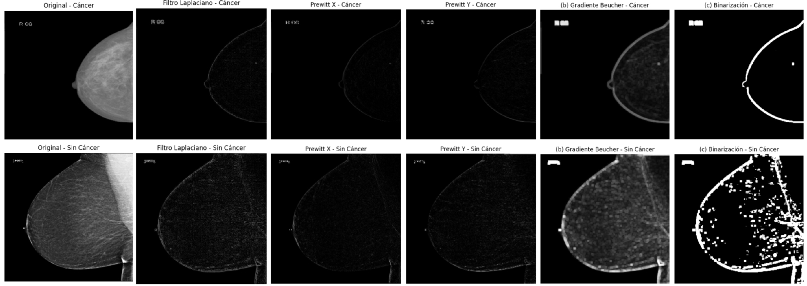
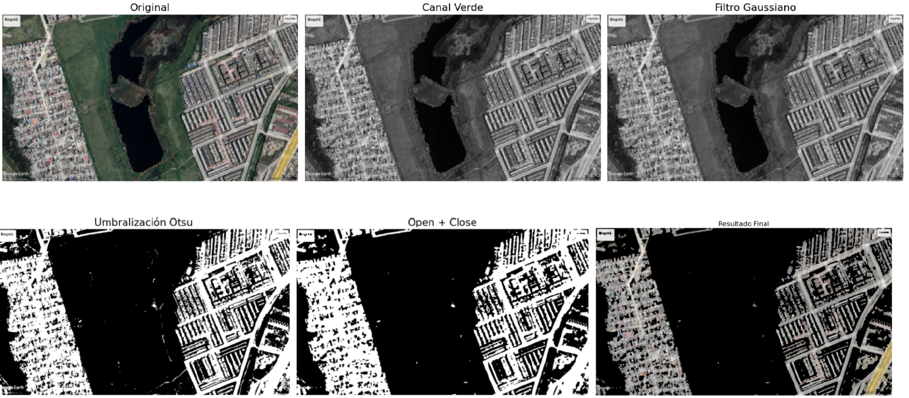
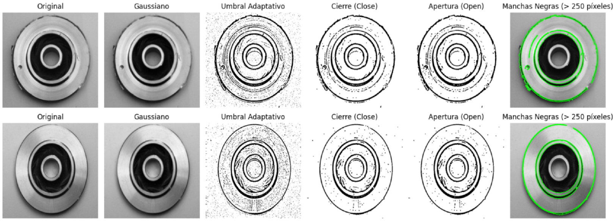

# Spatial and Morphological Filters in Real-World Scenarios

## Overview

This project explores the application of **spatial and morphological filters** on three types of images from public datasets: medical images (mammograms), satellite images of Bogotá, and industrial images of machinery parts.  

Filters applied include high-pass spatial filters, edge detection operators, and morphological operations to enhance relevant details and reduce noise. The combination of these techniques improves analysis and detection across different domains.  

---

## Datasets
1. **Industrial Casting Products** – Detect defects in industrial pieces. [Kaggle](https://www.kaggle.com/datasets/ravirajsinh45/real-life-industrial-dataset-of-casting-product)  
2. **Breast Cancer Detection** – Mammogram images for edge enhancement and structure detection. [Kaggle](https://www.kaggle.com/datasets/hayder17/breast-cancer-detection)  
3. **Satellite Images of Bogotá** – Analyze vegetation and urban areas. [Kaggle](https://www.kaggle.com/datasets/sleons2000/imagenes-satelitales-de-bogot)

---

## Methods

### Medical Images
- **Laplacian High-Pass Filter** – Detects rapid intensity changes (edges).  
- **Prewitt Operator** – Computes directional gradients to highlight edges.  
- **Beucher Morphological Gradient** – Highlights local contours:  
  \[ Gradient = Dilation - Erosion \]  

### Satellite Images
- **Green Channel Extraction** – Enhances vegetation.  
- **Gaussian Filter** – Smooths image and reduces noise.  
- **Otsu Thresholding** – Segments vegetation automatically.  
- **Morphological Operations** – Closing and opening to remove noise and refine edges.  

### Industrial Images
- **Grayscale Conversion + Gaussian Blur** – Reduces complexity and noise.  
- **Adaptive Thresholding** – Local pixel segmentation.  
- **Morphological Operations** – Clean edges and highlight defects.  

---

## Metrics
- **SSIM (Structural Similarity Index)** – Structural similarity, 0–1 (1 = max similarity).  
- **PSNR (Peak Signal-to-Noise Ratio)** – Signal-to-noise ratio in dB (higher = better).  
- **Morphological Area** – Evaluates black pixel areas for defect detection or segmentation accuracy.

---

## Results

### Medical Images
- Laplacian and Prewitt filters enhanced edges and details.  
- Beucher gradient and its binarization delineated contours clearly.  
- Cancer prediction example: 35% probability in affected image, 0% in healthy.  

  

All filters applied to mammograms (Laplacian, Prewitt, Beucher Gradient, Binarization).

### Satellite Images
- Green channel + Otsu thresholding allowed accurate vegetation segmentation.  
- Morphological closing and opening removed noise, improving quantification:  
  - Example A: 50.71% green area  
  - Example B: 64.46% green area  

   
  

All filters applied to satellite images (Green Channel, Otsu Threshold, Morphological Operations).

### Industrial Images
- Defect detection using morphological operations:  
  - Defective piece: 23 contours detected  
  - Non-defective piece: 6 contours detected  
- Adaptive thresholding + morphology effectively distinguished defects.

  

All filters applied to industrial pieces (Adaptive Threshold + Morphological Operations).

---
## Conclusions
- **Medical Images:** Enhanced edge visibility improves lesion identification.  
- **Satellite Images:** Accurate vegetation quantification aids urban and environmental planning.  
- **Industrial Images:** Morphological operations allow robust defect detection and quality control.  

**Limitations & Future Work:**  
- Spatial filters can amplify noise; morphological operations depend on structuring element size/shape.  
- Future improvements: combine with **deep learning (CNNs)** for adaptive, robust segmentation and analysis.  

---

## Author
Selene González Curbelo  
Universidad Internacional de la Rioja (UNIR)  
Course: *Computer Vision*  
Date: 2024
